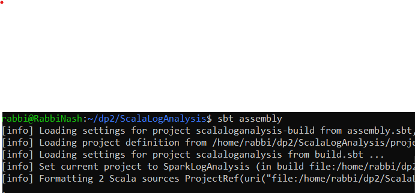

# Log Analysis With Scala

This sbt scala project which analyses log files

## Package

To package your project:
```bash
sbt assembly
```


## Deploy 

Copy/Upload the fatjar to the destination
```
TARGET_LOCATION=<location>
cp target/scala-2.12/spark-sbt-template-assembly-1.0.jar $TARGET_LOCATION
```


## Run

To run your project locally:
```
JAR_PATH=$(pwd)/target/scala-2.12/spark-sbt-template-assembly-1.0.jar
spark-submit --master=local[*] --deploy-mode client --class App $JAR_PATH
```


## To run on IntelliJ

Make sure you include the app.run file as follows.

```aidl
<component name="ProjectRunConfigurationManager">
  <configuration default="false" name="App" type="Application" factoryName="Application">
    <option name="ALTERNATIVE_JRE_PATH" value="11" />
    <option name="ALTERNATIVE_JRE_PATH_ENABLED" value="true" />
    <option name="INCLUDE_PROVIDED_SCOPE" value="true" />
    <option name="MAIN_CLASS_NAME" value="App" />
    <module name="SparkLogAnalysis" />
    <option name="PROGRAM_PARAMETERS" value="-s src/res/access.log.gz -r src/res/reports" />
    <option name="VM_PARAMETERS" value="-Dspark.master=local[*]" />
    <method v="2">
      <option name="Make" enabled="true" />
    </method>
  </configuration>
</component>
```
